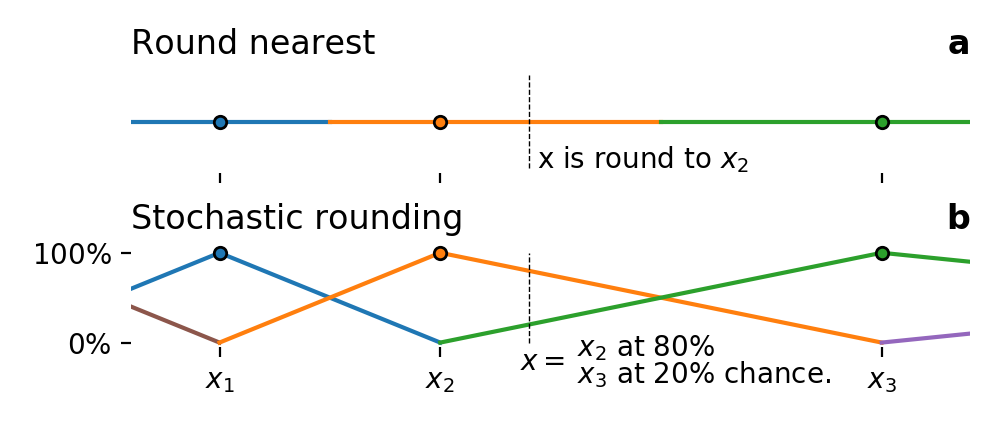

<p align="center">

</p>

# StochasticRounding.jl
[](https://travis-ci.com/milankl/StochasticRounding.jl)

Stochastic rounding for floating-point arithmetic.

This package exports `Float32sr`,`Float16sr`, and `BFloat16sr`, four number formats that behave
like their deterministic counterparts but with stochastic rounding that is proportional to the
distance of the next representable numbers and therefore
[exact in expectation](https://en.wikipedia.org/wiki/Rounding#Stochastic_rounding)
(see also example below in "Usage").  Although there is currently no/little known hardware implementation available, 
[Graphcore is working on IPUs with stochastic rounding](https://www.graphcore.ai/posts/directions-of-ai-research). 
Stochastic rounding makes the number formats considerably slower, but e.g. Float32+stochastic rounding is only
about 2x slower than Float64. 
[Xoroshiro128Plus](https://sunoru.github.io/RandomNumbers.jl/stable/man/xorshifts/#Xorshift-Family-1), 
a random number generator from the [Xorshift family](https://en.wikipedia.org/wiki/Xorshift), is used through the 
[RandomNumbers.jl](https://github.com/sunoru/RandomNumbers.jl) package, due to its speed and statistical properties.

You are welcome to raise [issues](https://github.com/milankl/StochasticRounding.jl/issues),
ask questions or suggest any changes or new features.

`BFloat16sr` is based on [BFloat16s.jl](https://github.com/JuliaMath/BFloat16s.jl)   
`Float16sr` is slow in Julia <1.6, but fast in Julia ^1.6 due to LLVM's `half` support.

### Usage

```julia
julia> a = BFloat16sr(1.0)
BFloat16sr(1.0)
julia> a/3
BFloat16sr(0.33398438)
julia> a/3
BFloat16sr(0.33203125)
```
As `1/3` is not exactly representable the rounding will be at 66.6% chance towards 0.33398438 
and at 33.3% towards 0.33203125 such that in expectation the result is 0.33333... and therefore exact. 
You can use `BFloat16_chance_roundup(x::Float32)` to get the chance that `x` will be round up.

From v0.3 onwards the random number generator is randomly seeded on every `import`
or `using` such that running the same calculations twice, will, in general, not
yield bit-reproducible results. However, you can seed the random number generator
at any time with any integer larger than zero as follows

```julia
julia> StochasticRounding.seed(2156712)
```

### Theory

Round-to-nearest (tie to even) is the standard rounding mode for IEEE floats. Stochastic rounding is explained in the following schematic



The exact result x of an arithmetic operation (located at one fifth between x₂ and x₃ in this example) is always round down to x₂ for round-to-nearest.
For stochastic rounding, only at 80% chance x is round down. At 20% chance it is round up to x₃, proportional to the distance of x between x₂ and x₃.

### Subnormals

From v0.6 onwards all subnormals of Float32, Float16, BFloat16 are always accounted for in the stochastic rounding.

### Installation
StochasticRounding.jl is registered in the Julia registry. Hence, simply do
```julia
julia>] add StochasticRounding
```
where `]` opens the package manager.

### Performance

StochasticRounding.jl is among the fastest software implementation of stochastic rounding for floating-point arithmetic. Define a few random 1000000-element arrays
```julia
julia> using StochasticRounding, BenchmarkTools, BFloat16s
julia> A = rand(Float64,1000000);
julia> B = rand(Float64,1000000);   # A, B shouldn't be identical as a+a=2a is not round
```
And similarly for the other number types. Then with Julia 1.6 on an Intel(R) Core(R) i5 (Ice Lake) @ 1.1GHz timings via `@btime +($A,$B)` are

| rounding mode         | Float64    | Float32    | Float16   | BFloat16    |
| --------------------- | ---------- | ---------- | --------- | ----------- |
| round to nearest      | 1132 μs    |  452 μs    | 1588 μs   |  354 μs     |
| stochastic rounding   | n/a        | 2815 μs    | 3310 μs   | 4100 μs     |

Stochastic rounding imposes an about x5 performance decrease for Float32, only x2 for Float16, but >10x for BFloat16.
For more complicated benchmarks the performance decrease is usually within x10.
About 50% of the time is spend on the random number generation with Xoroshiro128+.
